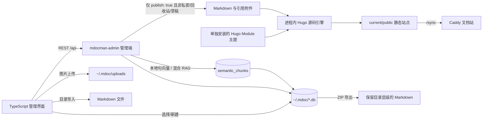
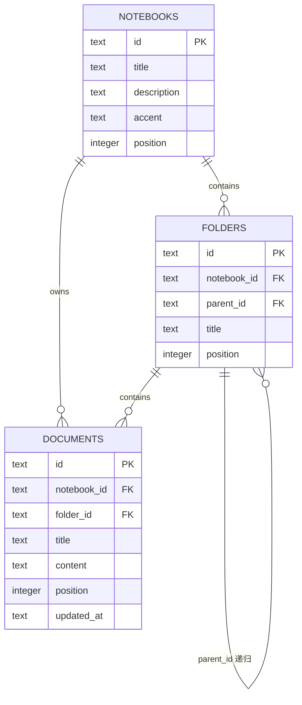

# Mdocman 架构与数据图

## 系统数据流

```mermaid
flowchart LR
    UI[TypeScript 管理界面] -->|REST /api| Admin[mdocman-admin 管理端]
    UI -->|选择/新建| Registry[(~/.mdoc/*.db)]
    Admin --> Registry
    Admin -->|本地句向量 / 混合 RAG| Semantic[(semantic_chunks)]
    Semantic --> Registry
    UI -->|图片上传| Assets[~/.mdoc/uploads]
    Admin -->|仅 publish: true 且非私密/回收站/草稿| Projection[Markdown 与引用附件]
    Themes[单独安装的 Hugo Module 主题] --> Hugo[进程内 Hugo 源码引擎]
    Projection --> Hugo
    Hugo --> Static[current/public 静态站点]
    Static -->|rsync| Site[Caddy 文档站]
    UI -->|目录导入| Import[Markdown 文件]
    Registry -->|ZIP 导出| Export[保留目录层级的 Markdown]
```

## SQLite 实体关系

```mermaid
erDiagram
    NOTEBOOKS ||--o{ FOLDERS : contains
    NOTEBOOKS ||--o{ DOCUMENTS : owns
    FOLDERS ||--o{ FOLDERS : "parent_id 递归"
    FOLDERS ||--o{ DOCUMENTS : contains
    NOTEBOOKS {
        text id PK
        text title
        text description
        text accent
        integer position
    }
    FOLDERS {
        text id PK
        text notebook_id FK
        text parent_id FK
        text title
        integer position
    }
    DOCUMENTS {
        text id PK
        text notebook_id FK
        text folder_id FK
        text title
        text content
        integer position
        text updated_at
    }
```

发布筛选、主题安装、服务器部署与 Caddy 配置见 [文档发布与 Hugo 主题](文档发布.md)。
