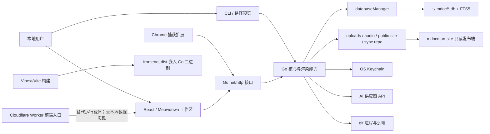
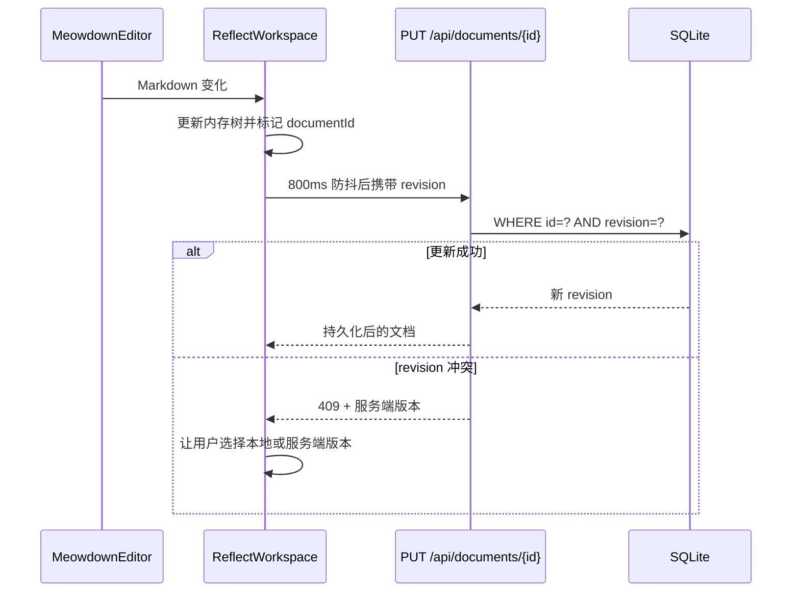

# 整体架构

## 1. 架构摘要

墨笺采用“本地单体核心 + 多个入口适配器”的混合架构：

- Go 进程是数据所有者和本地应用服务器，直接管理 SQLite、附件、发布目录、Keychain、Git 与 AI HTTP 调用。
- React 前端是富客户端，在内存中维护完整知识库树，执行编辑、导航、链接/任务投影和保存调度。
- CLI、路径预览、Chrome 扩展和只读发布端共享或消费核心能力，但各自有独立入口。
- Cloudflare Worker/Vinext 是前端的另一种运行载体；当前 `db/schema.ts` 为空，Worker 没有实现本地 Go API 的业务后端，因此不属于核心数据主链路。

它接近 Client–Server 与插件式适配器的组合，不是严格的 Clean Architecture：HTTP 处理、SQL、文件 I/O 和业务规则在多个 Go 文件中直接相连，前端也由一个大型工作区组件集中编排。

## 2. 系统边界

系统内部负责：

- 知识库层级、文档元数据和全文索引；
- Markdown 编辑派生能力；
- 本地附件、音频和静态站点生成；
- AI、捕获、同步、导入导出流程的编排；
- 管理端 Web 与 CLI/预览接口。

系统外部包括：

- 浏览器、PWA Service Worker 和 Chrome 扩展运行时；
- OpenAI、Anthropic、Google、OpenRouter；
- 操作系统 Keychain；
- 本机 `git` 进程与 Git 远端；
- 由静态站点访问者使用的浏览器；
- 可选的 Cloudflare Assets/Images/D1 环境。

## 3. 分层或组件结构



逻辑上可分为四层：

1. 入口与呈现：React、REST、CLI、路径预览、扩展、只读站点。
2. 应用编排：`ReflectWorkspace` 和各 Go HTTP handler。
3. 核心内容能力：知识层级、Markdown 派生、渲染、AI、捕获、音频、同步。
4. 基础设施：SQLite、文件系统、Keychain、Git、网络和构建工具。

## 4. 模块职责划分

| 一级模块 | 主要职责 | 边界 |
|---|---|---|
| 核心知识模型 | 定义笔记树与文档元数据；从 Markdown 派生链接、标签、任务、每日笔记 | 不直接管理外部供应商和部署 |
| 应用接口层 | 把用户动作转换为状态变更、API 调用或本地预览 | 不拥有最终持久状态 |
| 自动化与外部集成 | AI、资源描述、录音转录、浏览器采集、Git/导入导出 | 通过数据库和文件系统回写内容 |
| 数据、发布与运行基础设施 | 多数据库、文件目录、渲染、静态站点、构建与交付 | 为其他模块提供持久化与运行环境 |

## 5. 模块依赖方向

主要依赖方向是：

```text
React 视图与扩展
→ HTTP/CLI 入口
→ server 方法与内容规则
→ databaseManager / SQLite / 文件系统
→ Keychain、Git、AI 等外部能力
```

但存在两个重要的跨层事实：

- Markdown 语义被前后端共同实现。前端使用 YAML 库解析 frontmatter、计算链接和任务；后端使用较轻量的字符串/正则逻辑判断私密标记并渲染正文。
- 前端不是薄客户端。`ReflectWorkspace` 持有完整笔记树、dirty 状态、历史导航、冲突数据和自动同步计时器，结构性保存还会把整个树发送给后端。

## 6. 主要数据流

### 6.1 文档增量保存



### 6.2 结构性保存

笔记本、目录或文档增删会触发 `PUT /api/notebooks`。后端先缓存部分关联表，再在事务中删除并重建 `notebooks/folders/documents`，最后恢复分享、模板、聊天、捕获令牌和音频记录。该流程维护排序和树形结构，但没有单文档保存的修订冲突保护。

### 6.3 AI 问答

```text
用户问题
→ FTS5 查找当前知识库非私密文档
→ 剥离 frontmatter、限制上下文长度
→ 可选附加公开资源的本地 AI 描述
→ 供应商流式 API
→ SSE 返回浏览器
→ 对话与消息写入 SQLite
```

### 6.4 Git 备份

```text
SQLite 知识库
→ notes/daily/templates/assets 投影
→ git commit
→ fetch + merge
→ 冲突标记/manifest 合并
→ Markdown 回写 SQLite
→ push
```

## 7. 主要控制流

主程序先判断是否为路径参数，再初始化本地工作区和数据库；随后判断 CLI 命令，只有两者都不匹配时才启动 HTTP 服务。也就是说 `cmd/mdocman/main.go` 同时承担三种运行模式：

1. `mdoc <文件或目录>`：临时本机预览；
2. `mdocman today/search/show/path/...`：一次性 CLI；
3. `mdocman serve` 或无参数：长期运行管理端。

另有独立的 `cmd/mdocman-site/main.go` 只读服务，以及 `worker/index.ts` Cloudflare 前端入口。

## 8. 外部系统与依赖

| 依赖 | 架构作用 | 失败影响 |
|---|---|---|
| `modernc.org/sqlite` | 无 CGO 的本地数据库、WAL、FTS5 | 主应用无法启动或保存 |
| Goldmark/Chroma | 统一预览与静态发布渲染 | 预览、分享和生成站点失败 |
| Meowdown | 富 Markdown 编辑、链接/标签/附件交互 | 核心编辑体验不可用 |
| YAML | 保留并更新 frontmatter | 私密和别名元数据编辑受影响 |
| 系统 Keychain | 保存 AI 密钥与 Git 令牌 | 对应外部集成不可用 |
| AI 供应商 | 改写、问答、描述、转录 | 本地笔记功能仍可运行 |
| Git | 远端备份与双向回写 | 同步状态进入失败/离线 |
| Vinext/Vite/Wrangler | 前端开发、SSR/预渲染和 Worker 构建 | 前端构建或开发环境不可用 |

## 9. 运行与部署形态

- 开发：`dev.sh` 同时启动 Go API 和 Vinext/Vite，Vite 把 `/api`、附件和站点路径代理到 Go。
- 开发路径预览：`dev.sh <路径>` 跳过 Node，直接 `go run ./cmd/mdocman <路径>`。
- 管理端生产：`build.sh` 预渲染前端、复制到 `cmd/mdocman/frontend_dist`、编译为根目录 `mdoc` 单文件二进制。
- 发布端生产：同一脚本生成 `dist/bin/mdocman-site`，从 `SITE_DIR` 提供静态文件。
- 静态内容远端部署：`deploy.sh` 使用 `rsync --delete --checksum` 同步 `public-site/`。
- Cloudflare：`worker/index.ts` 可承载 Vinext 前端和图片优化，`build/sites-vite-plugin.ts` 打包 Sites 元数据；当前未提供与本地 Go 数据服务等价的云端业务实现。

## 10. 扩展点

- 在 `main` 注册新 HTTP 路由，并为 `server` 添加 handler。
- 在 `ReflectWorkspace` 增加新 `WorkspaceView` 或设置区组件。
- 在 `ReflectEditor` 的 Wiki、标签、Slash、选区 AI 和附件回调上扩展编辑能力。
- 在 `previewThemes` 与 `themes/default.css` 等主题文件中注册预览主题。
- 在 `supportedAIProvider`、`streamProvider`、`describeAssetProvider` 和转录分派中增加供应商。
- 在同步 manifest 中增加新的投影类型，但需同时修改导出、导入和冲突合并。

## 11. 架构特点与潜在风险

1. 本地优先边界清楚：SQLite 与普通文件是权威数据，AI 和 Git 是可选能力。
2. 前后端共享 Markdown 语义但实现不同，frontmatter 私密判断、渲染和编辑解析存在行为漂移风险。
3. `app/reflect/workspace.tsx` 接近 2,000 行，聚合状态、持久化、导航和多数功能，修改时回归面较大。
4. `cmd/mdocman/main.go` 同时含 schema、数据访问、API、渲染、发布与入口注册，模块边界主要依靠文件和方法约定。
5. `PUT /api/notebooks` 是整树重建；恢复关联记录时部分写入错误被忽略，并发结构编辑也没有版本校验。
6. HTTP 服务监听 `:"+port`、API 使用宽松 CORS 且没有管理端认证；在不可信网络环境运行会扩大本地数据暴露面。
7. 静态构建和分享路径没有在 `server.build`、`server.share` 中显式排除私密或废纸篓文档，需要把“私密”究竟只限制云 AI 还是也限制发布明确为产品策略。
8. Git 工作副本固定在项目相对路径 `data/sync/`，与主工作区 `~/.mdoc/` 不同；从其他工作目录运行或只部署二进制时需要验证路径预期。
9. Cloudflare Worker、空 D1 schema 与本地 Go 主链路同时存在，容易让部署边界产生误解。

## 12. 关键源代码位置

| 路径 | 关键符号 | 作用 |
|---|---|---|
| `cmd/mdocman/main.go` | `main`、`server`、`openDBAt` | 应用组合根、schema 与路由 |
| `app/reflect/workspace.tsx` | `ReflectWorkspace`、`persist` | 浏览器端应用编排与保存协议 |
| `app/reflect/reflect-editor.tsx` | `ReflectEditor` | 编辑器适配和内容交互 |
| `cmd/mdocman/workspace_databases.go` | `databaseManager` | 活动 SQLite 连接和工作区状态 |
| `cmd/mdocman/ai.go` | `groundingNotes`、`streamProvider` | AI 数据流与供应商适配 |
| `cmd/mdocman/sync.go` | `performSync` | Git 投影与同步控制流 |
| `cmd/mdocman/frontend.go` | `embeddedFrontendHandler` | 单二进制前端交付 |
| `worker/index.ts` | `worker.fetch` | Cloudflare/Vinext 前端入口 |
| `vite.config.ts` | 默认配置函数 | 开发代理、Worker 与构建插件 |
| `build.sh` | 脚本入口 | 生产构建和嵌入流程 |
